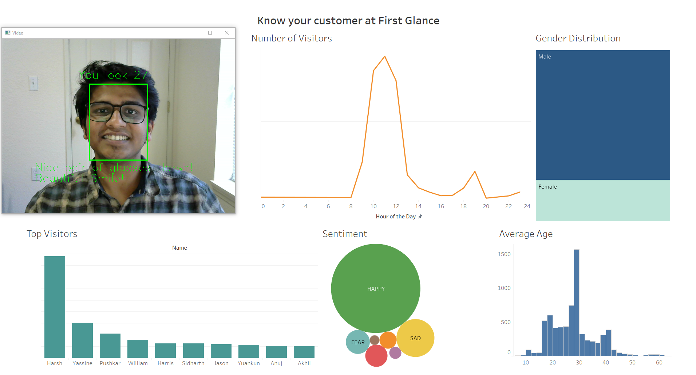
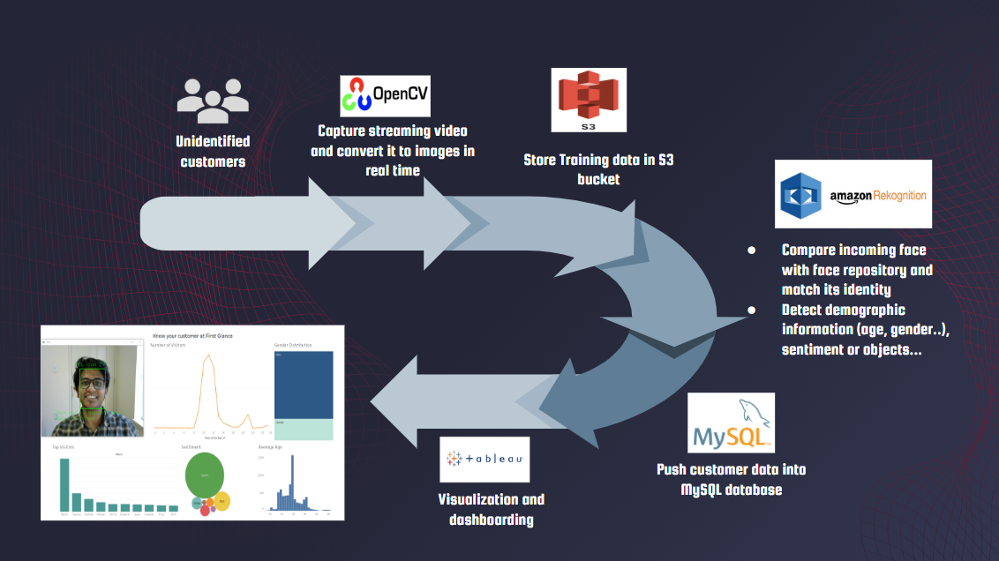

# Facial Rekognition and Analysis using AWS Rekognition

Facial Recognition & facial analysis for retail and security using AWS Rekognition.

We’ve heard plenty about computer vision, in competitions, articles, and coursework, but we don’t actually run into many uses of this technology in our everyday lives. When we go to the mall, attend schools, travel through transit hubs, stay at hotels, or contemplate choices in prison, we almost never see computer vision in use, even in spite of decades of exceptional growth. We know there is great value in these tools, as manufacturing and tech have are rapidly employing computer vision with great returns.

**This is why, we built a simple computer vision platform anyone can deploy. It's key features are:-**

1. Recognize individuals with just 1 image as training data ~ 100% accuracy (LinkedIn Headshots used as example)
2. Facial analysis including age, gender, sentiment, facial hair, and accessories such as glasses.
3. Personalised message to customer based on Facial analysis and recognition.
4. Logs stored in MySQL database.
5. Insights vidualized using Tableau.
6. Low cost of setup - All you need is an AWS account ($150 credits for students) and Tableau License (free for students). Even if you are not a student, AWS charges for this application are as low as 1 cent for analysing 100 images and $5 for storing upto 1M faces.

**Sample dashboard:-**

## Use Cases 

This application has a diverse set of use cases in security, retail and education. Here are a few examples:-

### 1. Capturing Customer Demographics at retail destinations

### 2. Customer and network identification with facial recognition

### 3. Product & service recommendations based on purchase history

### 4. Security enhancement by identifying unknown persons

## Process Flow

## Setup

This application is simple to setup and use.

### 1. Create MySQL Database

Create a logs table by running customer_demographics.sql

### 2. Create an AWS account with access to S3 and Rekognition and store training data in S3 bucket

https://docs.aws.amazon.com/AmazonS3/latest/user-guide/upload-objects.html

### 3. Index Faces

Update face_collection.py with the correct AWS credentials and change the collection name and S3 bucket name and run it to add faces to collection.

### 4. Let's get started

Run letsgetstart.py which opens up your web camera and starts storing the data. Remember to update the mysql password in the file.

### 5. Visualise on Tableau

Use the sample dashboard or create your own visualization from the MySQL database.

## Team

Get in touch with us if you need help implementing or want to contribute to this project.

(L-R) Harsh Seksaria, Hamed Khoojinian, Yingzi Wang, Yassine Manane, Peiyuan Wu
